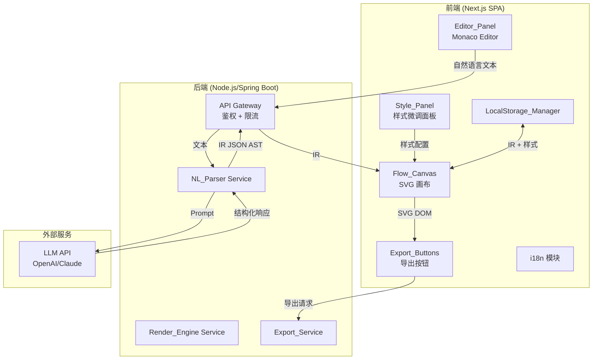
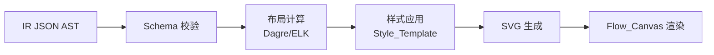

# 技术设计文档

## 概述

PaperFlow 是一个面向学术论文的智能流程图生成平台，核心理念是"LLM 生成结构 + 确定性引擎渲染"的分离架构。系统通过 JSON AST 中间表示（IR）连接自然语言解析与图形渲染两个阶段，实现模块解耦。

MVP 范围包括：
- 自然语言 → 流程图生成（顺序流程图、条件分支、系统架构图、功能模块图）
- 学术默认模板（academic-default）
- SVG/PNG 导出
- 免登录使用 + LocalStorage 会话持久化
- 基础样式微调
- 中英文双语界面

技术栈：
- 前端：React/Next.js SPA + SVG Canvas + Monaco Editor
- 后端：Node.js/Spring Boot
- 布局算法：Dagre/ELK
- 存储：LocalStorage（匿名用户）、MySQL/Redis（注册用户，MVP 后期）

## 架构

### 整体架构

系统采用前后端分离架构，前端为 Next.js SPA，后端提供 RESTful API。核心数据流为单向管道：

```
用户输入 → NL_Parser（LLM API）→ IR（JSON AST）→ Render_Engine → SVG → Flow_Canvas
```



### 渲染管道



### 关键设计决策

| 决策 | 选择 | 理由 |
|------|------|------|
| LLM 与渲染分离 | IR 作为中间层 | 确定性渲染，避免 LLM 直接生成 SVG 的不可控性 |
| 布局算法 | Dagre（默认）+ ELK（复杂图） | Dagre 轻量快速适合简单图，ELK 支持复杂层级布局 |
| 前端渲染 | SVG DOM 直接操作 | 学术场景需要矢量输出，SVG 天然支持导出 |
| 编辑器 | Monaco Editor | 语法高亮、自动补全，开发者友好 |
| 本地存储 | LocalStorage | MVP 阶段免登录，零服务端依赖 |
| 国际化 | next-intl | Next.js 生态原生支持，轻量 |


## 组件与接口

### 1. Editor_Panel（编辑器面板）

- 职责：提供自然语言输入区域（Monaco Editor）、生成按钮、样式微调面板
- 技术：React 组件 + Monaco Editor
- 接口：
  - `onGenerate(text: string): void` — 触发生成流程
  - `onStyleChange(config: StyleConfig): void` — 样式变更回调

### 2. NL_Parser Service（自然语言解析服务）

- 职责：接收自然语言文本，调用 LLM API，返回符合 IR Schema 的 JSON AST
- 技术：后端服务，封装 LLM API 调用 + Prompt 工程 + IR Schema 校验
- 接口：

```typescript
// POST /api/parse
interface ParseRequest {
  text: string;       // 用户输入的自然语言文本
  language: 'zh' | 'en';  // 输入语言
}

interface ParseResponse {
  success: boolean;
  ir?: IR;            // 符合 Schema 的 IR 文档
  error?: {
    code: string;
    message: string;
    suggestions?: string[];  // 输入建议
  };
}
```

### 3. Render_Engine（渲染引擎）

- 职责：将 IR 转换为带布局信息的 SVG 结构
- 技术：前端模块，使用 Dagre/ELK 计算布局，生成 SVG DOM
- 接口：

```typescript
interface RenderOptions {
  ir: IR;
  style: StyleConfig;
  layoutEngine: 'dagre' | 'elk';
}

interface RenderResult {
  svgElement: SVGElement;
  dimensions: { width: number; height: number };
}

function render(options: RenderOptions): RenderResult;
```

### 4. Export_Service（导出服务）

- 职责：将 SVG 转换为目标格式（SVG 文件 / PNG）
- 技术：前端模块，SVG 序列化 + Canvas API（PNG 转换）
- 接口：

```typescript
interface ExportOptions {
  svgElement: SVGElement;
  format: 'svg' | 'png';
  dpi?: 300 | 600;        // PNG 专用
  embedFonts?: boolean;    // SVG 专用，默认 true
}

function exportFlowchart(options: ExportOptions): Promise<Blob>;
```

### 5. LocalStorage_Manager（本地存储管理器）

- 职责：管理 IR 和样式配置的本地持久化
- 技术：浏览器 LocalStorage API 封装
- 接口：

```typescript
interface SessionData {
  ir: IR;
  styleConfig: StyleConfig;
  timestamp: number;
}

function saveSession(data: SessionData): void;
function loadSession(): SessionData | null;
function clearSession(): void;
```

### 6. Flow_Canvas（流程图画布）

- 职责：展示渲染后的 SVG 流程图，支持缩放和平移
- 技术：React 组件，SVG 容器
- 接口：
  - `ir: IR` — 输入 IR 数据
  - `style: StyleConfig` — 样式配置
  - `onRenderComplete(): void` — 渲染完成回调

### 7. API Gateway（API 网关）

- 职责：鉴权、限流、请求路由
- 技术：后端中间件
- 鉴权：API Key / Token 验证
- 限流：令牌桶算法，按客户端 IP 限制请求频率

### API 端点设计

| 端点 | 方法 | 描述 | 鉴权 | 限流 |
|------|------|------|------|------|
| `POST /api/parse` | POST | 自然语言解析为 IR | 是 | 10 次/分钟 |
| `GET /api/health` | GET | 健康检查 | 否 | 无 |


## 数据模型

### IR（中间表示）JSON Schema

IR 是系统的核心数据结构，连接 NL_Parser 和 Render_Engine。

```typescript
// IR 根结构
interface IR {
  version: '1.0';
  metadata: IRMetadata;
  nodes: IRNode[];
  edges: IREdge[];
  groups: IRGroup[];
}

interface IRMetadata {
  title?: string;
  createdAt: string;       // ISO 8601
  sourceLanguage: 'zh' | 'en';
  chartType: 'sequential' | 'conditional' | 'architecture' | 'tree';
}

// 节点定义
interface IRNode {
  id: string;              // 唯一标识符，格式：node_<uuid>
  label: string;           // 显示文本
  type: 'process' | 'decision' | 'start' | 'end' | 'subprocess';
  position?: {             // 布局后填充
    x: number;
    y: number;
  };
  size?: {                 // 布局后填充
    width: number;
    height: number;
  };
  groupId?: string;        // 所属分组 ID
}

// 边定义
interface IREdge {
  id: string;              // 唯一标识符，格式：edge_<uuid>
  source: string;          // 源节点 ID
  target: string;          // 目标节点 ID
  label?: string;          // 连线标签（如 "是"/"否"）
  type: 'normal' | 'conditional';
}

// 分组定义（层级结构）
interface IRGroup {
  id: string;              // 唯一标识符，格式：group_<uuid>
  label: string;           // 分组标题
  children: string[];      // 子节点/子分组 ID 列表
  parentGroupId?: string;  // 父分组 ID（嵌套时使用）
}
```

### IR JSON Schema（用于校验）

```json
{
  "$schema": "http://json-schema.org/draft-07/schema#",
  "type": "object",
  "required": ["version", "metadata", "nodes", "edges", "groups"],
  "properties": {
    "version": { "const": "1.0" },
    "metadata": {
      "type": "object",
      "required": ["createdAt", "sourceLanguage", "chartType"],
      "properties": {
        "title": { "type": "string" },
        "createdAt": { "type": "string", "format": "date-time" },
        "sourceLanguage": { "enum": ["zh", "en"] },
        "chartType": { "enum": ["sequential", "conditional", "architecture", "tree"] }
      }
    },
    "nodes": {
      "type": "array",
      "items": {
        "type": "object",
        "required": ["id", "label", "type"],
        "properties": {
          "id": { "type": "string", "pattern": "^node_" },
          "label": { "type": "string", "minLength": 1 },
          "type": { "enum": ["process", "decision", "start", "end", "subprocess"] },
          "position": {
            "type": "object",
            "properties": {
              "x": { "type": "number" },
              "y": { "type": "number" }
            }
          },
          "size": {
            "type": "object",
            "properties": {
              "width": { "type": "number", "minimum": 0 },
              "height": { "type": "number", "minimum": 0 }
            }
          },
          "groupId": { "type": "string" }
        }
      }
    },
    "edges": {
      "type": "array",
      "items": {
        "type": "object",
        "required": ["id", "source", "target", "type"],
        "properties": {
          "id": { "type": "string", "pattern": "^edge_" },
          "source": { "type": "string" },
          "target": { "type": "string" },
          "label": { "type": "string" },
          "type": { "enum": ["normal", "conditional"] }
        }
      }
    },
    "groups": {
      "type": "array",
      "items": {
        "type": "object",
        "required": ["id", "label", "children"],
        "properties": {
          "id": { "type": "string", "pattern": "^group_" },
          "label": { "type": "string" },
          "children": { "type": "array", "items": { "type": "string" } },
          "parentGroupId": { "type": "string" }
        }
      }
    }
  }
}
```

### StyleConfig（样式配置）

```typescript
interface StyleConfig {
  fontFamily: {
    zh: string;    // 默认：'SimSun'（宋体）
    en: string;    // 默认：'Times New Roman'
  };
  fontSize: number;          // 默认：12（pt）
  borderWidth: number;       // 默认：1（px）
  borderColor: string;       // 默认：'#000000'
  fillColor: string;         // 默认：'#FFFFFF'
  arrowStyle: 'solid';       // MVP 仅支持实线
  lineStyle: 'orthogonal';   // MVP 仅支持直角折线
  colorScheme: 'monochrome'; // MVP 仅支持单色体系
}
```

### SessionData（会话数据）

```typescript
interface SessionData {
  ir: IR;
  styleConfig: StyleConfig;
  timestamp: number;         // Unix 时间戳
  version: string;           // 数据格式版本，用于迁移
}
```

### IR 示例

```json
{
  "version": "1.0",
  "metadata": {
    "title": "数据处理流程",
    "createdAt": "2024-01-15T10:30:00Z",
    "sourceLanguage": "zh",
    "chartType": "conditional"
  },
  "nodes": [
    { "id": "node_1", "label": "开始", "type": "start" },
    { "id": "node_2", "label": "读取数据", "type": "process" },
    { "id": "node_3", "label": "数据有效？", "type": "decision" },
    { "id": "node_4", "label": "处理数据", "type": "process" },
    { "id": "node_5", "label": "报告错误", "type": "process" },
    { "id": "node_6", "label": "结束", "type": "end" }
  ],
  "edges": [
    { "id": "edge_1", "source": "node_1", "target": "node_2", "type": "normal" },
    { "id": "edge_2", "source": "node_2", "target": "node_3", "type": "normal" },
    { "id": "edge_3", "source": "node_3", "target": "node_4", "label": "是", "type": "conditional" },
    { "id": "edge_4", "source": "node_3", "target": "node_5", "label": "否", "type": "conditional" },
    { "id": "edge_5", "source": "node_4", "target": "node_6", "type": "normal" },
    { "id": "edge_6", "source": "node_5", "target": "node_6", "type": "normal" }
  ],
  "groups": []
}
```


## 正确性属性

*正确性属性是指在系统所有合法执行中都应成立的特征或行为——本质上是对系统应做什么的形式化陈述。属性是连接人类可读规格说明与机器可验证正确性保证之间的桥梁。*

### 属性 1：IR 序列化往返一致性

*对于任意*合法的 IR 文档，将其序列化为 JSON 字符串再反序列化后，应产生与原始 IR 深度相等的对象。

**验证需求：2.5**

### 属性 2：IR 结构完整性

*对于任意*合法的 IR 文档，以下条件应同时成立：(a) 所有节点 ID 唯一；(b) 所有边的 source 和 target 引用的节点 ID 存在于节点列表中；(c) 所有分组的 children 引用的 ID 存在于节点列表或分组列表中。

**验证需求：2.1, 2.2, 2.3**

### 属性 3：IR Schema 校验一致性

*对于任意* NL_Parser 的输出，该输出应通过预定义的 IR JSON Schema 校验，包含 version、metadata、nodes、edges、groups 等必需字段，且每个字段符合类型和格式约束。

**验证需求：1.1, 2.4**

### 属性 4：布局无重叠

*对于任意*合法的 IR 文档，经 Render_Engine 布局计算后，任意两个节点的边界框不应存在重叠。

**验证需求：1.3**

### 属性 5：渲染标签保真

*对于任意*合法的 IR 文档，Render_Engine 生成的 SVG 中包含的文字标签集合应与 IR 中所有节点 label 和边 label 的集合完全一致（不多不少）。

**验证需求：1.4**

### 属性 6：学术模板无渐变无阴影

*对于任意*使用 academic-default 模板渲染的 SVG 输出，SVG 内容中不应包含 linearGradient、radialGradient、filter（阴影）等元素或属性。

**验证需求：3.1**

### 属性 7：样式变更不影响 IR

*对于任意* IR 和任意样式变更操作（包括字体切换、字号调整、边框粗细调整、填充色替换、界面语言切换），操作后的 IR 应与操作前的 IR 深度相等。

**验证需求：4.4, 10.2**

### 属性 8：会话持久化往返一致性

*对于任意* SessionData（包含 IR 和 StyleConfig），执行 saveSession 后再执行 loadSession，返回的数据应与原始 SessionData 深度相等。

**验证需求：7.2, 7.3**

### 属性 9：SVG 导出包含内嵌字体

*对于任意*合法的 IR 文档，导出的 SVG 文件内容中应包含字体定义信息（@font-face 声明或内嵌字体数据）。

**验证需求：5.1**

### 属性 10：PNG 导出尺寸与 DPI 成比例

*对于任意*合法的 SVG 和任意 DPI 设置（300 或 600），导出的 PNG 图像的像素尺寸应与 SVG 的逻辑尺寸和所选 DPI 成正比关系。

**验证需求：6.2**

### 属性 11：条件分支节点必有条件边

*对于任意*合法的 IR 文档，若 IR 中存在 type 为 decision 的节点，则该节点必须至少有一条 type 为 conditional 的出边。

**验证需求：8.2**

### 属性 12：分组子元素引用有效性

*对于任意*合法的 IR 文档，若 IR 中存在 group，则该 group 的 children 列表中的每个 ID 必须对应一个存在的节点或子分组。

**验证需求：8.3**

### 属性 13：图表类型决定布局策略

*对于任意*合法的 IR 文档，Render_Engine 应根据 metadata.chartType 选择对应的布局策略：sequential 和 conditional 使用自上而下布局，tree 使用层级布局，architecture 使用分层布局。

**验证需求：8.4**

### 属性 14：未授权请求返回 401

*对于任意*不携带有效鉴权凭证的 API 请求，后端应返回 HTTP 401 状态码。

**验证需求：12.1, 12.2**

### 属性 15：超频请求返回 429

*对于任意*超过频率限制阈值的客户端请求，后端应返回 HTTP 429 状态码，且响应头中包含 Retry-After 字段。

**验证需求：12.3, 12.4**

### 属性 16：解析失败返回错误信息

*对于任意*无法被解析为有效流程结构的输入文本，NL_Parser 应返回包含非空错误消息和输入建议的错误响应。

**验证需求：11.1**


## 错误处理

### 错误分类与处理策略

| 错误类型 | 触发条件 | 处理策略 | 用户提示 |
|----------|----------|----------|----------|
| 解析失败 | NL_Parser 无法从输入中提取流程结构 | 返回错误码 + 建议 | "无法识别流程结构，请尝试使用更明确的步骤描述" |
| Schema 校验失败 | NL_Parser 返回的 IR 不符合 JSON Schema | 自动重试一次；仍失败则返回错误 | "生成结果异常，请重试" |
| LLM API 超时 | LLM API 响应超过 30 秒 | 超时中断 + 返回错误 | "服务响应超时，请稍后重试" |
| LLM API 错误 | LLM API 返回 4xx/5xx | 返回错误 + 重试按钮 | "服务暂时不可用，请点击重试" |
| 导出失败 | SVG/PNG 导出过程异常 | 捕获异常 + 返回错误 | "导出失败，请检查流程图是否完整" |
| 鉴权失败 | 请求未携带有效凭证 | 返回 HTTP 401 | "请求未授权" |
| 频率限制 | 请求频率超过阈值 | 返回 HTTP 429 + Retry-After | "请求过于频繁，请稍后再试" |
| 浏览器不兼容 | 检测到不支持的浏览器版本 | 显示升级提示 | "请升级浏览器至最新版本" |

### 错误响应格式

```typescript
interface ErrorResponse {
  success: false;
  error: {
    code: string;           // 错误码，如 'PARSE_FAILED', 'SCHEMA_INVALID', 'LLM_TIMEOUT'
    message: string;        // 用户可读的错误描述
    suggestions?: string[]; // 输入建议（解析失败时提供）
    retryable: boolean;     // 是否可重试
  };
}
```

### 重试策略

- NL_Parser Schema 校验失败：自动重试 1 次，使用相同输入
- LLM API 超时/错误：不自动重试，提供手动重试按钮
- 导出失败：不自动重试，提示用户检查流程图

## 测试策略

### 属性测试（Property-Based Testing）

使用 `fast-check` 库（JavaScript/TypeScript 生态中成熟的属性测试库）进行属性测试。

每个属性测试配置：
- 最少 100 次迭代
- 每个测试用注释标注对应的设计文档属性
- 标注格式：**Feature: paperflow, Property {number}: {property_text}**
- 每个正确性属性由一个属性测试实现

#### 属性测试清单

| 属性 | 测试描述 | 生成器 |
|------|----------|--------|
| 属性 1 | IR 序列化/反序列化往返 | 随机生成合法 IR 文档 |
| 属性 2 | IR 结构完整性（ID 唯一、引用有效） | 随机生成 IR，包含各种节点/边/分组组合 |
| 属性 3 | NL_Parser 输出 Schema 校验 | 随机生成 IR，验证 Schema 校验器行为 |
| 属性 4 | 布局无重叠 | 随机生成不同规模的 IR（1-30 节点） |
| 属性 5 | 渲染标签保真 | 随机生成含各种 Unicode 字符标签的 IR |
| 属性 6 | 学术模板无渐变无阴影 | 随机生成 IR，使用 academic-default 渲染 |
| 属性 7 | 样式变更不影响 IR | 随机生成 IR + 随机样式变更序列 |
| 属性 8 | 会话持久化往返 | 随机生成 SessionData |
| 属性 9 | SVG 导出含内嵌字体 | 随机生成 IR，执行 SVG 导出 |
| 属性 10 | PNG 尺寸与 DPI 成比例 | 随机生成 SVG 尺寸 + 随机 DPI |
| 属性 11 | 条件分支节点必有条件边 | 随机生成含 decision 节点的 IR |
| 属性 12 | 分组子元素引用有效 | 随机生成含 group 的 IR |
| 属性 13 | 图表类型决定布局策略 | 随机生成不同 chartType 的 IR |
| 属性 14 | 未授权请求返回 401 | 随机生成不含/含无效凭证的请求 |
| 属性 15 | 超频请求返回 429 | 模拟超频请求序列 |
| 属性 16 | 解析失败返回错误信息 | 随机生成无效/无意义输入文本 |

#### IR 生成器设计

```typescript
// fast-check 自定义 Arbitrary 示例
const arbNodeType = fc.constantFrom('process', 'decision', 'start', 'end', 'subprocess');
const arbEdgeType = fc.constantFrom('normal', 'conditional');
const arbChartType = fc.constantFrom('sequential', 'conditional', 'architecture', 'tree');

const arbNode = fc.record({
  id: fc.uuid().map(u => `node_${u}`),
  label: fc.string({ minLength: 1, maxLength: 50 }),
  type: arbNodeType,
});

const arbIR = fc.tuple(
  fc.array(arbNode, { minLength: 1, maxLength: 20 }),
  arbChartType
).chain(([nodes, chartType]) => {
  const nodeIds = nodes.map(n => n.id);
  const arbEdge = fc.record({
    id: fc.uuid().map(u => `edge_${u}`),
    source: fc.constantFrom(...nodeIds),
    target: fc.constantFrom(...nodeIds),
    label: fc.option(fc.string({ maxLength: 20 })),
    type: arbEdgeType,
  });
  return fc.record({
    version: fc.constant('1.0' as const),
    metadata: fc.record({
      createdAt: fc.constant(new Date().toISOString()),
      sourceLanguage: fc.constantFrom('zh' as const, 'en' as const),
      chartType: fc.constant(chartType),
    }),
    nodes: fc.constant(nodes),
    edges: fc.array(arbEdge, { maxLength: 30 }),
    groups: fc.constant([]),
  });
});
```

### 单元测试

单元测试聚焦于具体示例、边界情况和集成点：

| 测试类别 | 测试内容 | 对应需求 |
|----------|----------|----------|
| NL_Parser 示例 | 各图表类型的具体输入/输出示例 | 1.2, 8.1 |
| 学术模板默认值 | 验证默认字体、配色、连线样式 | 3.2, 3.3, 3.4 |
| 编辑器面板控件 | 验证样式微调面板包含所有必需控件 | 4.1 |
| PNG DPI 选项 | 验证支持 300dpi 和 600dpi | 6.1 |
| 免登录访问 | 验证未登录状态下所有功能可用 | 7.1 |
| 首屏布局 | 验证首屏包含输入区域和生成按钮 | 9.2, 9.3 |
| 国际化配置 | 验证 zh/en 两种语言包完整 | 10.1 |
| 双语解析示例 | 中英文输入的具体解析示例 | 10.3 |
| LLM 错误处理 | 模拟 LLM 超时/错误，验证重试和提示 | 11.2, 11.3, 11.4 |
| 浏览器检测 | 验证不支持的浏览器显示升级提示 | 13.3 |
